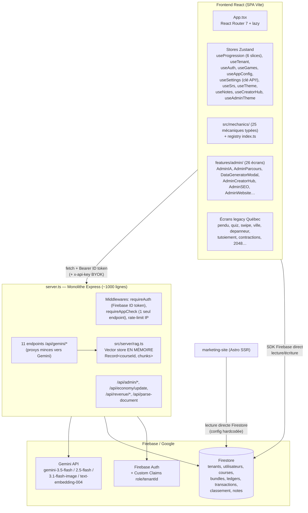
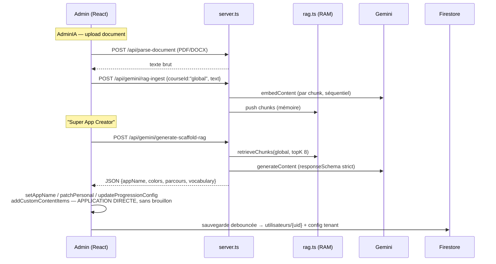
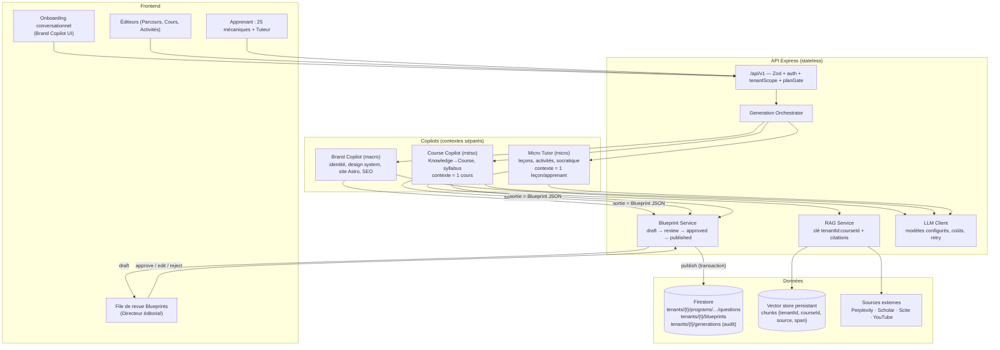
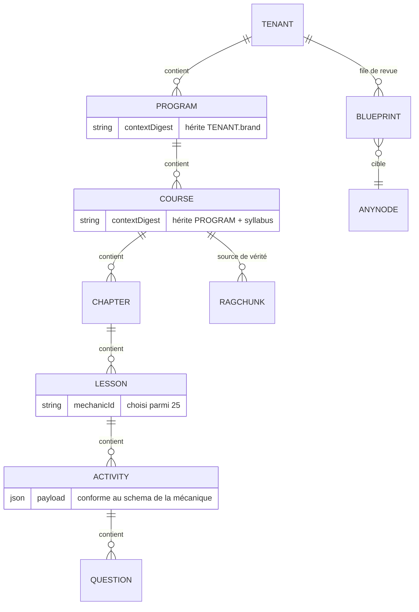
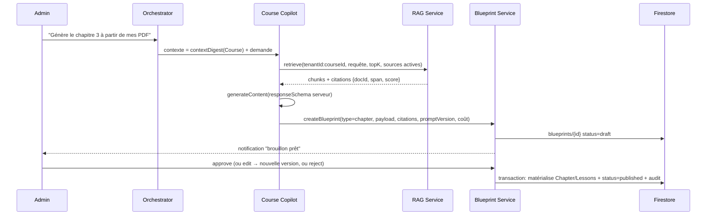

# AUDIT COMPLET — DEEP GENERATION OS
## Due diligence technique, gap analysis et plan de refonte

> **Périmètre** : `codebase_repomix.md` (250 fichiers, ~43 800 lignes packées) traité comme unique source de vérité. `plan.md` traité comme document historique à auditer.
> **Convention** : tout élément absent du code est marqué **"Non trouvé dans la codebase."** Toute inférence non directement vérifiable est préfixée **"Hypothèse :"**.
> **Date de l'audit** : 2026-07-02.

---

# MISSION 1 — RECONSTRUCTION ARCHITECTURALE (ÉTAT RÉEL)

## 1.1 Vue d'ensemble

Le produit réel est un **LMS SaaS multi-tenant gamifié** (nom interne "EduForge", ex-"Mots & Blocs", app d'apprentissage du français québécois) et **non encore un OS de génération pédagogique**. C'est un monorepo npm workspaces à deux applications :

| Application | Stack | Rôle |
|---|---|---|
| Racine (`/`) | React 19 + Vite 6 + TS 5.8 + Tailwind 4 + Zustand 5 + React Router 7, servie par un monolithe Express (`server.ts`) | App apprenant + panneau admin + API IA |
| `marketing-site/` | Astro SSR + Tailwind + `astro-seo` | Sites vitrines multi-tenant, sitemaps, JSON-LD |



**Fait structurant** : le frontend écrit **directement** dans Firestore (via SDK client + `firestore.rules`) pour la quasi-totalité du métier (cours, bundles, progression, config tenant), tandis que le serveur Express n'est utilisé que pour l'IA, les rôles, l'économie et les royalties. Il n'existe **pas de couche API métier unifiée**.

## 1.2 Frontend (React / Zustand)

### Routing & shell
- `src/App.tsx` : React Router 7, `React.lazy` + `Suspense` sur ~28 écrans, résolution du thème tenant depuis `tenants/{id}.appTheme`, `resolveTenantFromDomain()` au boot.
- `src/components/AppShell.tsx`, `ErrorBoundary.tsx`, Sentry React.

### State management (Zustand 5)
| Store | Persistance | Contenu | Observation critique |
|---|---|---|---|
| `useProgression` | Firestore (`utilisateurs/{uid}`) via `syncSlice` (debounce) | 6 slices : economy, inventory, settings, stats, courses, sync + `progressionConfig` (niveaux→chapitres→leçons) + `customContentItems` | **Le contenu généré par IA (`customContentItems`) est stocké dans le document UTILISATEUR**, pas au niveau tenant/cours (`syncSlice.ts` : lecture/écriture de `data.customContentItems`) |
| `useTenant` | `localStorage` (`quebec-tenant`) | Tenant courant, défaut hardcodé `eduforge`, `simulateTenantSwitch` avec 3 tenants codés en dur | Persistance locale d'un contexte de sécurité |
| `useAuth` | mémoire | `User` + custom claims | OK |
| `useGames` | `localStorage` (`quebec-games`) | Registre de jeux (5 jeux par défaut) | **Le catalogue de jeux d'un tenant vit dans le navigateur de l'admin**, pas en BDD |
| `useAppConfig` | `localStorage` | Nom app, nav, devise, tags, `FeatureFlags` (4 booléens), config SRS | Feature flags **client-side uniquement**, non liés au plan du tenant, non vérifiés serveur |
| `useSettings` | `localStorage` (`quebec-settings`) | **Clé API Gemini (BYOK)**, persona, contexte, prompt de scaffolding, méta-documents | **Clé API en clair dans localStorage** |
| `useSrs` | Firestore (`utilisateurs/{uid}/srs`) | Sessions FSRS, `recentFailures` | OK |
| `useCreatorHub` | Firestore (`courses`, `bundles`) | CRUD cours/bundles côté client | OK (isolation par rules) |
| `useTheme` / `useAdminTheme` / `useNotes` | localStorage / Firestore | Thème tokens, notes privées | OK |

### Mécaniques de jeu
- `src/mechanics/01…25_*.tsx` : **25 mécaniques typées** (interfaces dans `src/types/mechanics.ts`, lots 1-5), registre `src/mechanics/index.ts`, mapping de contenu `src/services/mechanicDataMapper.ts`, matrice de compatibilité `COMPATIBILITY_MATRIX` (`src/types/index.ts`).
- `DynamicGameScreen.tsx` dispatche les **25** mécaniques ; `LessonGameScreen.tsx` n'en dispatche que **4** (FlashcardSRS, Hangman, MultipleChoice, BinarySwipe).
- **Triplication du code** : `src/mechanics/*.tsx` (production) + `design_handoff_theme_system/mechanics/*.jsx` (handoff, 25 fichiers) + écrans legacy dédiés (`PenduScreen`, `QuizScreen`, `SwipeScreen`, `SortScreen`…).

### Pipeline pédagogique côté client
- `contentProvider.ts` : `LocalJsonContentProvider` = **JSON statiques buildés** (`mots.json`, `anglicismes.json`, `quiz.json`) + `customContentItems` du store utilisateur. Aucun provider Firestore/serveur.
- Moteur SRS : `src/services/srs.ts`, **FSRS v5 via `ts-fsrs`**, fonctions pures, extension R1 (`consecutive_lapses`, `is_blocked`). Bonne qualité.
- `DashboardMemorielScreen` (R2), `AITutorChat` (R12 : contexte d'échecs récents injecté, disclaimer de limites).

## 1.3 Backend (Node / Express)

Un unique fichier **`server.ts` (~1000 lignes)** : bootstrap Firebase Admin, Sentry + profiling, multer (10 MB), rate limiting IP (100 req/15 min global, 50/15 min Gemini), Vite middleware en dev / static en prod.

### Inventaire exhaustif des endpoints
| Endpoint | Auth | App Check | Rôle |
|---|---|---|---|
| `GET /api/health` | non | non | Healthcheck |
| `POST /api/admin/bootstrap` | Auth | non | **Attribue superadmin si `user.email === 'bastienp2014@gmail.com'` (hardcodé)** |
| `POST /api/admin/members/invite` | Auth | **oui (seul endpoint)** | Création user + custom claims + `tenants/{id}/members` |
| `POST /api/admin/members/remove` | Auth | non | Retrait claims + membre |
| `POST /api/economy/update` | Auth | non | **Incrémente `piasses`/`xp` avec les montants fournis par le client, sans validation métier** |
| `GET /api/revenue/ledgers` / `transactions` | Auth | non | Lecture filtrée tenant/creator |
| `POST /api/revenue/process-transaction` | Auth (admin) | non | Split 70/30 (`calculateRevenueSplits`), transaction Firestore atomique |
| `POST /api/gemini/generate-scenario` | Auth + limiter | non | Scénarios dialogues (schéma strict), prompt **hardcodé "français québécois"** |
| `POST /api/gemini/generate-image` | Auth + limiter | non | `gemini-3.1-flash-image` |
| `POST /api/gemini/generate-marketing` | Auth + limiter | non | Landing copy JSON (`gemini-2.5-flash`) |
| `POST /api/gemini/generate-json` | Auth + limiter | non | Générique : **le client fournit le `responseSchema`** |
| `POST /api/gemini/chat` | Auth + limiter | non | Tuteur (historique client, `ai.chats.create`) |
| `POST /api/gemini/rag-ingest` | Auth + limiter | non | Chunk + embed + stockage mémoire — **aucune vérification de propriété du `courseId`, aucune limite de taille** |
| `POST /api/gemini/generate-lesson-rag` | Auth + limiter | non | Retrieval top-5 + rédaction leçon, directive "zéro hallucination" |
| `POST /api/gemini/generate-json-rag` | Auth + limiter | non | Retrieval top-5 + JSON schéma client |
| `POST /api/gemini/generate-scaffold-rag` | Auth + limiter | non | Retrieval top-8 + "Gros JSON" (app complète : nom, couleurs, parcours, vocabulaire) |
| `POST /api/gemini/generate-items-rag` | Auth + limiter | non | Items + analyse pédagogique R11 (schéma combiné) |
| `POST /api/gemini/suggest-mechanic` | Auth + limiter | non | **Enum de 5 mécaniques seulement** : `["quiz","flashcard","drag_drop","fill_in_the_blank","memory"]` |
| `POST /api/parse-document` | Auth | non | PDF (`pdf-parse`), DOCX (`mammoth`), TXT/MD |
| `POST /api/debug/error` | **aucune** | non | **Append illimité dans `client_errors.log`** |
| `GET /api/debug-sentry` | **aucune** | non | Throw volontaire (actif en prod) |

Pattern commun aux endpoints IA : `const apiKey = req.headers['x-api-key'] || process.env.GEMINI_API_KEY` — **BYOK par header client avec repli silencieux sur la clé plateforme**.

## 1.4 Services IA & pipeline RAG actuel

`src/server/rag.ts` (120 lignes) :

| Composant | Implémentation réelle |
|---|---|
| Vector store | `const vectorStore: Record<string, RagIndex> = {}` — **RAM du process Node**. Perdu à chaque redéploiement/restart ; incompatible multi-instances (Cloud Run) |
| Isolation | Clé = `courseId` **seul**. Aucun `tenantId`, aucun contrôle d'accès : tout utilisateur authentifié de n'importe quel tenant peut ingérer/interroger n'importe quel `courseId` |
| `courseId` utilisé en pratique | `"global"` hardcodé dans `AdminIA.tsx`, `AdminParcours.tsx`, `DataGeneratorModal.tsx` → **un index unique partagé entre tous les tenants** |
| Chunking | Caractères (1000, overlap 200), coupure sur `.` |
| Embeddings | `text-embedding-004`, **séquentiel** chunk par chunk |
| Retrieval | Cosinus brute-force, topK 3-8. Pas de seuil de score, pas de reranking, pas d'hybride lexical, pas de métadonnées de source, pas de citations restituées (seul `sources: N` en compte) |
| Ingestion | Pas de dédup, pas de quota, pas de limite de texte |

**Intégrations externes (Perplexity, Google Scholar, Scite, YouTube, Typst)** : **Non trouvé dans la codebase.** (uniquement mentionnées dans `plan.md` §14.6/14.7 et `CHANGELOG.md`).

**Orchestrateur d'agents / multi-copilots / files de génération / mémoire de conversation persistée** : **Non trouvé dans la codebase.** Chaque endpoint est un proxy stateless ; l'"orchestration" (enchaînement scaffold → application au state) vit dans les handlers React (`AdminIA.genererScaffold`).

## 1.5 Flux de données de génération (réel)



## 1.6 Marketing (Astro) & SEO
- SSR multi-tenant : `middleware.ts`, routes `[tenant]/…`, `sitemap.xml.ts` par tenant, `Schema.astro` (JSON-LD), `TenantLayout.astro` + `astro-seo`.
- `tenantApi.ts` : **config Firebase hardcodée dans le source** (projectId, apiKey web, databaseId) ; lecture directe de `tenants` par domaine puis par id.
- `AdminSEO.tsx` : dashboard avec **données GSC/GA4 simulées** (conforme au plan). `AdminWebsite.tsx` : config landing sauvegardée via `setDoc` Firestore.

## 1.7 Sécurité (constats bruts)
- `firestore.rules` : deny-by-default, isolation `tenantId`, protections d'escalade (`isAdmin`, champs économiques verrouillés en update client). Points faibles : `tenants/{id}` et `configuration/**` en **`read: if true`** (public) ; email superadmin **hardcodé** dans les rules (également dans `server.ts` et `syncSlice.ts`) ; fallback `getUserTenantId() → 'eduforge'`.
- `secureFetch.ts` (App Check côté client) **défini mais jamais appelé** ; `requireAppCheck` appliqué à un seul endpoint.
- Tests : 3 fichiers (`revenue.test.ts`, `tileColors.test.ts`, `useTenant.test.ts`). E2E : **Non trouvé** (Puppeteer en devDeps, aucun test l'utilisant). CI : **Non trouvé dans la codebase** (aucun workflow).
- Paiement réel (Stripe/PSP) : **Non trouvé dans la codebase.** `db:push` référence `drizzle-kit` sans dépendance ni schéma Drizzle (script mort) ; `scripts/directus-setup.cjs` est **vide** (fichier mort).

---

# MISSION 2 — GAP ANALYSIS (RÉEL vs VISION DEEP GENERATION)

Légende gravité : **P0** bloquant vision/sécurité · **P1** critique · **P2** important · **P3** amélioration.

| # | Exigence vision | État réel (preuve) | Impact | Gravité | Dette | Coût migration |
|---|---|---|---|---|---|---|
| G1 | Hiérarchie **Plateforme→Programme→Cours→Chapitre→Leçon→Activité→Question** avec héritage de contexte | Deux modèles **parallèles et non reliés** : (a) `ProgressionConfig` = niveaux→chapitres→leçons stocké dans `tenants/{id}/configuration/progression` (mono-arbre par tenant) ; (b) `Course/Module/Lesson/Bundle/Product` (`types/index.ts`) sans lien vers (a). Pas d'entité Programme, Activité ni Question. `ContentItem` est plat et **rangé dans le doc utilisateur** | La génération multi-cours et l'héritage de contexte sont impossibles sans refonte du modèle | **P0** | Très élevée | 15-25 j/h (modèle + migration + rules) |
| G2 | **Règle d'or Blueprint** : toute sortie IA = blueprint JSON strict, jamais d'écriture finale directe | `responseSchema` Gemini strict ✔, mais **aucune entité Blueprint en BDD** ; `genererScaffold` (`AdminIA.tsx`) applique directement nom/couleurs/parcours/vocabulaire aux stores puis Firestore ; `generate-lesson-rag` écrit dans le champ de config | Violation directe du principe fondateur ; pas d'audit trail, pas de rollback, pas de versioning | **P0** | Élevée | 10-15 j/h (collection `blueprints` + workflow) |
| G3 | **Isolation hermétique par cours** du Course Copilot | RAG indexé par `courseId` **sans contrôle d'accès ni tenant** ; en pratique `courseId:"global"` partout → index mutualisé inter-tenants | **Fuite de données inter-tenants** (un tenant peut lire les documents ingérés d'un autre) + hallucination croisée | **P0** | Élevée | 5-8 j/h (clé composite + ACL + purge) |
| G4 | RAG durable et scalable | Store **en mémoire** ; perdu au restart, incompatible >1 instance | Toute la promesse "Knowledge to Course" repose sur un composant volatile | **P0** | Élevée | 8-12 j/h (Firestore vector search ou pgvector/Qdrant) |
| G5 | **Human-in-the-loop systématique** | Partiel : `DataGeneratorModal` a une vraie étape review R3/R11 ✔ ; scaffold = application directe ✘ ; scénarios générés "statut: brouillon" par prompt (non garanti par code) ; `Course.status` draft/published ✔ | HITL non uniforme = principe non garanti | **P1** | Moyenne | Couvert par G2 |
| G6 | **Sélection dynamique parmi 25 mécaniques** | `suggest-mechanic` limité à **5 valeurs**, dont `drag_drop` et `fill_in_the_blank` qui **ne correspondent à aucun id** du registre (`useGames` : `flashcard/pendu/quiz/swipe` ; `mapMechanicData` : autres ids) ; `LessonGameScreen` ne dispatche que 4 mécaniques | Le cœur différenciant (25 templates) n'est pas exploitable par l'IA ; suggestions cassées si non mappées | **P1** | Moyenne | 4-6 j/h (registre méta + enum 25 + dispatch complet) |
| G7 | **Brand Copilot** avec onboarding conversationnel admin | **Non trouvé.** `OnboardingScreen.tsx` = onboarding apprenant (SAAQ/Québec). L'admin configure via formulaires ; le scaffold est un one-shot prompt | Le point d'entrée produit de la vision n'existe pas | **P1** | Moyenne | 8-12 j/h |
| G8 | Enrichissement RAG externe (Perplexity, Scholar, Scite) + toggle sources | **Non trouvé dans la codebase.** | Pas de sourcing factuel externe, pas de citations | **P2** | — | 10-15 j/h (couche `SourceProvider`) |
| G9 | **Micro Tutor socratique adaptatif** | `AITutorChat` = chat contextuel (échecs récents + persona) avec disclaimer honnête ; pas de stratégie socratique structurée, pas de mémoire persistée, pas de RAG leçon | Tuteur v0 correct mais loin du niveau 3 de la vision | **P2** | Faible | 6-10 j/h |
| G10 | Feature flags par plan/tenant, appliqués serveur | 4 booléens dans `useAppConfig` **persistés en localStorage**, jamais vérifiés côté serveur ni liés à `tenant.plan` | Monétisation de la génération non applicable ; contournable trivialement | **P1** | Moyenne | 3-5 j/h |
| G11 | Économie/valeur contrôlée serveur | `/api/economy/update` accepte des montants arbitraires du client (les rules Firestore bloquent l'écriture directe, mais l'endpoint la réintroduit) | Triche XP/monnaie → corruption leaderboard/récompenses | **P1** | Faible | 2-3 j/h (montants dérivés serveur d'événements validés) |
| G12 | Sécurité des clés IA | Clé Gemini BYOK en **localStorage** + transmise en header + fallback clé plateforme | Vol de clé via XSS ; abus de la clé plateforme par tout utilisateur authentifié | **P1** | Faible | 2-4 j/h (stockage serveur chiffré par tenant + quotas) |
| G13 | Généricité produit (OS multi-verticales) | Restes Québec omniprésents : prompts serveur ("français québécois"), écrans `ville/depanneur/tutoiement…`, clés localStorage `quebec-*`, i18n "survie" | L'OS n'est pas neutre ; chaque nouveau tenant hérite d'artefacts hors sujet | **P2** | Élevée | 8-12 j/h (nettoyage + extraction verticale en contenu seed) |
| G14 | Observabilité IA (traces, coûts, evals) | Sentry ✔ ; aucun log structuré des générations, aucun coût/token tracking, aucune eval | Impossible de piloter qualité/coût de la génération | **P2** | — | 5-8 j/h |
| G15 | Génération documentaire Typst | **Non trouvé dans la codebase.** | Feature premium absente (conforme plan : non cochée) | **P3** | — | 8-12 j/h |
| G16 | CI/CD + E2E | **Non trouvé** (pas de workflow ; Puppeteer inutilisé) | Régressions non détectées | **P2** | Moyenne | 3-5 j/h |

**Synthèse** : la vision est violée sur ses trois invariants structurants — hiérarchie (G1), blueprint (G2), isolation de contexte (G3/G4) — qui sont tous P0. Le reste est du rattrapage classique.

---

# MISSION 3 — AUDIT NOTÉ DU SYSTÈME (/10)

| Dimension | Note | Forces (preuves) | Faiblesses (preuves) | Recommandations concrètes |
|---|---:|---|---|---|
| **Architecture globale** | **4,5** | Monorepo clair ; séparation app/marketing ; lazy loading ; slices Zustand | Double voie d'écriture (SDK client + Express) sans couche métier ; monolithe `server.ts` ; état critique en localStorage (`useGames`, `useAppConfig`, `useTenant`) ; triplication des mécaniques | Introduire une couche `src/server/{routes,services,repositories}` ; migrer toute config tenant vers Firestore ; supprimer `design_handoff_theme_system` du build (archive) |
| **Qualité du code** | **6** | Mécaniques typées strictement (lots 1-5, plan "Gold Standard" tenu) ; `srs.ts` pur et documenté ; `revenue.ts` testé | `any` résiduels (handlers, `GameConfig.data?: any`) ; `alert()` massif dans l'admin ; fichiers morts (`fix.js`, `scripts/directus-setup.cjs` vide, `scripts/out.txt`, `tsconfig.tsbuildinfo` versionné) ; script `db:push` sans Drizzle | Zod aux frontières API ; bannir `alert` (toasts) ; purge des fichiers morts ; ESLint strict en CI |
| **Séparation des responsabilités** | **4** | Slices `useProgression` bien découpés ; `mechanicDataMapper` isole l'adaptation | `AdminIA.tsx` mélange UI + orchestration + persistance ; contenu pédagogique dans le doc **utilisateur** ; endpoints IA acceptent le `responseSchema` du client (logique métier déportée au front) | Schémas de génération **côté serveur uniquement** ; service `GenerationService` ; collection `tenants/{id}/contentItems` |
| **Robustesse React** | **6,5** | React 19, Router 7, ErrorBoundary, Suspense, sélecteurs stricts | `LessonGameScreen` limité à 4 mécaniques ; états locaux dupliqués (config copiée par `JSON.parse(JSON.stringify())` dans `AdminParcours`) ; i18n squelettique | Dispatch unique des 25 mécaniques (factory partagée avec `DynamicGameScreen`) ; immer pour l'édition de config |
| **Robustesse Node** | **3,5** | Rate limiting, Sentry+profiling, transactions Firestore atomiques (revenue) | Monolithe sans validation d'entrée (aucun Zod/celebrate), `JSON.parse` direct des sorties LLM, endpoints debug non authentifiés, App Check quasi inactif, port hardcodé | Router par domaine, validation systématique, retry/backoff Gemini, supprimer `/api/debug-sentry` en prod |
| **Robustesse Zustand** | **6** | Pattern slices exemplaire ; persistance debouncée | `persist` utilisé pour des données de sécurité/config multi-tenant ; clés `quebec-*` héritées | Réserver `persist` aux préférences UI ; source de vérité Firestore pour tenant/games/flags |
| **Maturité architecture IA** | **3,5** | `responseSchema` strict systématique ✔ ; personas paramétrables ; R3/R11 dans `DataGeneratorModal` ; directive anti-hallucination | Pas d'entité Blueprint ; pas de versioning de prompts (prompts inline dans handlers) ; pas d'orchestrateur ; modèles hardcodés éparpillés (`gemini-3.5-flash`, `2.5-flash`, `3.1-flash-image`) ; aucun coût/token tracking | Registre de prompts versionnés ; table `generations` (input, prompt_version, output, coût) ; abstraction `LlmClient` |
| **Maturité RAG** | **2** | Pipeline complet minimal (parse→chunk→embed→retrieve) fonctionnel ; embeddings dédiés | En mémoire, mono-instance, index global inter-tenants, pas de citations, pas de reranking, pas d'éval, chunking naïf, ingestion sans quota | Voir Mission 6/7 : store persistant + clé `tenantId/courseId` + citations obligatoires + eval de fidélité |
| **Maturité Agents** | **1** | — | **Non trouvé** : aucun agent, aucune boucle outil, aucune mémoire | Introduire l'orchestrateur de copilots (Mission 6) avant tout framework agentique |
| **Scalabilité** | **3** | Cloud Run-ready pour le stateless ; Astro SSR séparé | RAG stateful en RAM (bloque l'horizontal scaling), rate limit par IP en mémoire (multi-instances = quotas incohérents), embeddings séquentiels, `client_errors.log` sur disque | Externaliser tout état (vector store, rate limit Redis/Firestore), batcher les embeddings, jobs asynchrones pour l'ingestion |
| **Sécurité** | **4** | Rules deny-by-default + isolation tenant + anti-escalade ; Auth réelle + custom claims ; rate limiting | Email admin hardcodé (3 emplacements) ; `tenants` et `configuration` publics en lecture ; `/api/economy/update` non validé ; BYOK en localStorage + fallback clé plateforme ; endpoints debug ouverts ; config Firebase dupliquée hardcodée (`tenantApi.ts`) | Hotfixes P0/P1 de la Phase 0 (Mission 8) |

---

# MISSION 4 — AUDIT DE `plan.md` vs CODE

> `plan.md` uploadé = copie exacte du `plan.md` du repo (diff : espaces finaux uniquement). Classification : ✅ implémenté · 🟡 partiel · ❌ absent · ⚠️ obsolète/inexact.

## 4.1 Vérification par phase

| Élément du plan | Statut | Preuve / écart |
|---|---|---|
| Ph.1 Thème dynamique, `useAdminTheme`, gabarit jeu, `useAppConfig` | ✅ | Fichiers présents et branchés |
| Ph.2 Registre jeux, devise, feature flags, RBAC, tags, SRS branché | 🟡 | Tout existe, **mais** flags/jeux/config en localStorage (non multi-device, non serveur) ; "Feature Flags & Marque Blanche : permissions granulaires" est **surévalué** (4 booléens) |
| Ph.3 BYOK, persona, RAG upload, BGC, tuteur, scaffolding | ✅/🟡 | Implémenté ; BYOK insécurisé ; "Base de Connaissances" volatile (RAM) — le plan ne le dit pas |
| Ph.4 & 4.1 Hub contenu, migration mécaniques, matrice compat, parcours, théorie | ✅ | `contentProvider`, `COMPATIBILITY_MATRIX`, `LessonGameScreen`, éditeur `AdminParcours` |
| Ph.5 Auth+rôles, domaines custom, dashboard financier, forfaits | 🟡 | Auth/rôles ✔ ; domaines : résolution par champ `domain` ✔ mais provisioning/verification **Non trouvé** ; AdminStats/Forfaits ✔ (données partiellement simulées) |
| Ph.6/7 Site vitrine, SEO headless, Astro SSR, sitemaps, JSON-LD, teaser | ✅/🟡 | Astro complet ✔ ; "Moteur SEO/GEO automatisé : génération asynchrone par l'IA" → **génération asynchrone Non trouvée** (page `[niche].astro` templée, pas de moteur IA) ; AdminSEO = **GSC/GA4 simulés** (dit dans le plan, exact) |
| Ph.8 Produits/Bundles/Entitlements/progressions par cours | 🟡 | Modèles + CRUD ✔ ; **enforcement des entitlements** minimal : `hasAccessToCourse` retourne `true` si `isPremium` ou `isAdmin` (client-side) ; achat réel/PSP **Non trouvé** |
| Ph.9 RBAC `TenantMember`, revenue share, membres, royalties | 🟡 | Types + UI + endpoints revenue ✔ ; `RevenueShareAgreement` **non persisté** (l'UI d'AdminMembers fait `alert('Accord enregistré')` sans écriture) ; split hardcodé 30 % dans `process-transaction` |
| Ph.10 Audits | ⚠️ | Coché "Terminé" mais non vérifiable dans le code — déclaratif |
| Ph.11 Remédiation sécurité | 🟡 | Beaucoup fait (rules, claims, Sentry, App Check, slices, router, Vitest) **mais** : "rendre la valeur économique read-only côté client et la déplacer côté serveur" est **contredit** par `/api/economy/update` non validé ; "App Check intégré" ⚠️ (1 endpoint, `secureFetch` jamais utilisé) ; "ESLint en CI" ❌ (pas de CI) |
| Ph.15 Design handoff 25 mécaniques | ✅ | Fait — mais le handoff source reste dans le repo (dette) |
| Ph.12 (Notes, analytics actionnables, transcript, pré/post-tests, skill graph) | 🟡/❌ | Notes ✅ (`useNotes`, `PrivateNotesWidget`, rules `notes/{userId}`) — **non coché dans le plan alors que c'est implémenté** ; Smart Actions ❌ ; Transcript ❌ ; Pré/post-tests ❌ ; Skill graph ❌ |
| Ph.13.1 R1/R2/R3/R12 | ✅ | `is_blocked`, `DashboardMemorielScreen`, review `DataGeneratorModal`, tuteur connecté |
| Ph.13.2 R11 ✅ ; R4 (26e mécanique génération) ❌ ; R6/R7 ❌ | conforme | |
| Ph.14.1 RAG : upload ✅, pipeline ✅ (mais volatile), scaffolding ✅, granulaire 🟡 (bouton leçon RAG dans AdminParcours ✔, exercices par leçon ❌) | | |
| Ph.14.2 Mapping intelligent 25 mécaniques ❌ (5 seulement, ids incohérents) ; sélecteur flexible 🟡 (apprenant : oui via Arcade/SRS ; créateur : champ `mechanic` manuel) | | |
| Ph.14.3 Génération site Astro par IA ❌ (copy marketing générée ✔ via `generate-marketing`, pages non générées) ; design par persona ❌ | | |
| Ph.14.4 Leaderboards | 🟡 | `LeaderboardScreen` + collection `classement` existent (**non listé comme fait**) ; cohortes ❌ |
| Ph.14.5 Flags par forfait ❌ ; monétisation génération ❌ | | |
| Ph.14.6 APIs externes (Perplexity/YouTube/SEO/Scholar/Scite, toggle) | ❌ | **Non trouvé dans la codebase.** |
| Ph.14.7 Typst | ❌ | **Non trouvé dans la codebase.** |

## 4.2 Features présentes dans le code mais absentes/mal documentées dans le plan
1. `AdminMarketingGenerator.tsx` + `/api/gemini/generate-marketing` (copywriting landing) — non tracé.
2. `Notes privées` livrées (plan les laisse "[ ]").
3. `InteractiveTeaser`, `MarketingPreviewScreen` cochés ✔ mais leur dépendance au paywall réel (inexistant) n'est pas signalée.
4. Écrans legacy Québec (12+ features) : dette invisible totale — le plan ne mentionne jamais leur dépréciation.
5. Endpoints debug (`/api/debug/*`) : dette de sécurité invisible.
6. `seed_course.ts`, `fix.js`, scripts `fix_*.cjs` : outillage jetable non gouverné.

## 4.3 Verdict sur `plan.md`
Document **majoritairement fiable sur le "quoi"** (les cases cochées correspondent à ~85 % à du code réel) mais **trompeur sur le "comment"** : il présente comme acquises des fondations qui sont en réalité volatiles (RAG RAM), locales (flags/jeux localStorage), ou contournables (économie serveur). Sa structure chronologique (phases 1→15 non ordonnées, 15 avant 12) le rend inutilisable comme roadmap. → Reconstruit en Mission 5 (fichier livré séparément : **`plan.md` v2**).

---

# MISSION 5 — RECONSTRUCTION DE `plan.md`

Le nouveau plan est livré en fichier séparé (`plan.md`, joint à cet audit). Principes de reconstruction :
1. **Section "État vérifié"** : uniquement ce qui est prouvé dans le code (avec fichiers), pour repartir d'une base honnête.
2. **Réorganisation par capacité produit** (Fondations → Blueprint Engine → RAG durable → Copilots → Mécaniques dynamiques → Marketing/SEO → Monétisation/Flags → Typst), chaque item avec critère d'acceptation testable.
3. **Alignement vision** : chaque phase référence l'invariant qu'elle sert (Hiérarchie, Blueprint, Isolation, HITL, Multi-copilots).

---

# MISSION 6 — ARCHITECTURE CIBLE

## 6.1 Principes directeurs (justifications)
1. **Une seule voie d'écriture métier** : le client ne fait plus de `setDoc` sur le contenu ; tout passe par l'API (permet HITL, validation Zod, audit trail, feature flags serveur). Les lectures temps réel restent en SDK Firestore (économique, réactif).
2. **Le Blueprint comme citoyen de première classe** : collection dédiée, machine à états, versionnée. C'est l'implémentation directe de la Règle d'or et du HITL — un seul mécanisme au lieu de N conventions par écran.
3. **Contexte hiérarchique matérialisé** : chaque nœud (Programme→…→Question) porte un `contextDigest` hérité + enrichi, injecté dans les prompts. C'est ce qui rend le "multi-cours hermétique" réel plutôt que déclaratif.
4. **RAG = service isolé avec clé composite `tenantId:courseId`** et providers de sources pluggables (docs internes, Perplexity, Scholar…) — l'isolation devient structurelle, pas disciplinaire.
5. **Stateless partout** : vector store, quotas, files de génération externalisés → Cloud Run horizontal.

## 6.2 Arborescence cible

```
/
├─ apps/
│  ├─ web/                      # SPA React (apprenant + admin) — ex-src/
│  │  └─ src/
│  │     ├─ features/…          # inchangé, moins les écrans legacy Québec
│  │     ├─ mechanics/          # 25 mécaniques (source unique)
│  │     └─ stores/             # Zustand: UI prefs uniquement en persist
│  └─ marketing/                # Astro SSR (ex-marketing-site)
├─ packages/
│  ├─ shared/                   # Types + Zod schemas partagés front/back
│  │  ├─ hierarchy.ts           # Platform→Program→Course→Chapter→Lesson→Activity→Question
│  │  ├─ blueprints.ts          # Blueprint<T>, statuts, schémas JSON
│  │  └─ mechanics-registry.ts  # Métadonnées des 25 mécaniques
│  └─ prompts/                  # Prompts versionnés (fichiers, testables)
├─ server/
│  ├─ index.ts                  # bootstrap uniquement
│  ├─ routes/                   # admin, economy, revenue, generation, rag, tutor
│  ├─ middleware/               # auth, appCheck, tenantScope, planGate (flags)
│  ├─ services/
│  │  ├─ generation/
│  │  │  ├─ orchestrator.ts     # routeur de copilots
│  │  │  ├─ brandCopilot.ts     # onboarding conversationnel + marketing
│  │  │  ├─ courseCopilot.ts    # Knowledge→Course (syllabus, leçons)
│  │  │  └─ microTutor.ts       # activités + tuteur socratique
│  │  ├─ blueprints/            # création, validation, publication (commit BDD)
│  │  ├─ rag/
│  │  │  ├─ pipeline.ts         # ingest/retrieve avec citations
│  │  │  ├─ stores/firestoreVector.ts   # (ou qdrant.ts)
│  │  │  └─ sources/            # localDocs, perplexity, scholar, scite, youtube
│  │  ├─ llm/client.ts          # abstraction modèle + coûts + retry
│  │  └─ economy/, revenue/…
│  └─ repositories/             # accès Firestore typé par agrégat
└─ infra/                       # rules, indexes, CI, IaC
```

## 6.3 Diagramme cible — copilots & blueprint engine



## 6.4 Hiérarchie de données cible (héritage de contexte)



Chaque nœud stocke `contextDigest` (résumé structuré ≤ ~1 k tokens du contexte parent) régénéré à la publication du parent — c'est ce qui permet "hérite du contexte supérieur / enrichit le niveau inférieur / modifiable indépendamment" sans recharger tout l'arbre à chaque appel LLM.

## 6.5 Cycle de vie d'une génération (séquence cible)



Justifications clés : (a) le `responseSchema` défini serveur ferme la faille actuelle "schéma fourni par le client" ; (b) les citations rendent le "zéro hallucination" vérifiable au lieu d'être une incantation de prompt ; (c) `generations` (audit) donne coût/qualité par prompt_version → base des tests de régression (Mission 10).

---

# MISSION 7 — DESIGN BLUEPRINTS & CODE RÉUTILISABLE

## 7.1 Interfaces TypeScript des Blueprints (packages/shared/blueprints.ts)

```typescript
// packages/shared/blueprints.ts
export type BlueprintStatus = 'draft' | 'in_review' | 'approved' | 'rejected' | 'published';

export type BlueprintType =
  | 'brand_identity' | 'marketing_site' | 'seo_page'
  | 'program' | 'course_syllabus' | 'chapter' | 'lesson'
  | 'activity' | 'question_set';

export interface Citation {
  sourceId: string;              // id du document/chunk source (ou URL externe)
  provider: 'local_docs' | 'perplexity' | 'google_scholar' | 'scite' | 'youtube';
  span?: { start: number; end: number };
  score: number;                 // similarité/confiance
  quote?: string;                // extrait court justificatif
}

export interface GenerationMeta {
  copilot: 'brand' | 'course' | 'micro_tutor';
  model: string;                 // ex: "gemini-3.5-flash"
  promptId: string;              // ex: "course.syllabus"
  promptVersion: string;         // ex: "2026-07-01.1" — versionné dans packages/prompts
  inputTokens: number;
  outputTokens: number;
  costUsd: number;
  latencyMs: number;
  ragQuery?: string;
  citations: Citation[];
}

/** Enveloppe générique — AUCUNE sortie IA ne touche la BDD sans passer par elle. */
export interface Blueprint<TPayload = unknown> {
  id: string;
  tenantId: string;
  type: BlueprintType;
  /** Nœud de la hiérarchie ciblé par la publication (null pour brand/marketing). */
  target: { programId?: string; courseId?: string; chapterId?: string; lessonId?: string } | null;
  status: BlueprintStatus;
  version: number;               // incrémenté à chaque édition humaine
  payload: TPayload;             // validé par le JSON Schema du type
  generation: GenerationMeta;
  review?: {
    reviewerId: string;
    decidedAt: string;
    comment?: string;
    humanEdits?: Partial<TPayload>;   // diff appliqué avant publication
  };
  createdAt: string;
  updatedAt: string;
  publishedAt?: string;
  publishedNodeIds?: string[];   // audit trail de la matérialisation
}

/** Exemples de payloads typés */
export interface CourseSyllabusPayload {
  title: string;
  summary: string;
  learningObjectives: string[];
  chapters: Array<{
    title: string;
    description: string;
    lessons: Array<{
      title: string;
      summary: string;
      suggestedMechanics: MechanicSuggestion[];   // cf. 7.3
      estimatedMinutes: number;
    }>;
  }>;
}

export interface ActivityPayload {
  lessonId: string;
  mechanicId: MechanicId;        // union stricte des 25 ids — cf. 7.3
  rationale: string;             // pourquoi cette mécanique (traçabilité pédagogique)
  data: unknown;                 // conforme au schema JSON de la mécanique (7.3)
  difficulty: 1 | 2 | 3 | 4 | 5;
  tags: string[];
}
```

## 7.2 JSON Schema strict — Blueprint `course_syllabus` (validation serveur ET `responseSchema` Gemini)

```json
{
  "$id": "https://schemas.deepgen.app/blueprint/course_syllabus/1.0.json",
  "type": "object",
  "additionalProperties": false,
  "required": ["title", "summary", "learningObjectives", "chapters"],
  "properties": {
    "title": { "type": "string", "minLength": 3, "maxLength": 120 },
    "summary": { "type": "string", "minLength": 20, "maxLength": 1200 },
    "learningObjectives": {
      "type": "array", "minItems": 3, "maxItems": 12,
      "items": { "type": "string", "minLength": 8, "maxLength": 240 }
    },
    "chapters": {
      "type": "array", "minItems": 1, "maxItems": 20,
      "items": {
        "type": "object", "additionalProperties": false,
        "required": ["title", "description", "lessons"],
        "properties": {
          "title": { "type": "string", "maxLength": 120 },
          "description": { "type": "string", "maxLength": 800 },
          "lessons": {
            "type": "array", "minItems": 1, "maxItems": 15,
            "items": {
              "type": "object", "additionalProperties": false,
              "required": ["title", "summary", "suggestedMechanics", "estimatedMinutes"],
              "properties": {
                "title": { "type": "string", "maxLength": 120 },
                "summary": { "type": "string", "maxLength": 600 },
                "estimatedMinutes": { "type": "integer", "minimum": 2, "maximum": 90 },
                "suggestedMechanics": {
                  "type": "array", "minItems": 1, "maxItems": 3,
                  "items": {
                    "type": "object", "additionalProperties": false,
                    "required": ["mechanicId", "confidence", "reason"],
                    "properties": {
                      "mechanicId": { "type": "string", "enum": [
                        "flashcard_srs","multiple_choice","binary_swipe","memory_match","hangman",
                        "anagram","cloze_test","sequencing","sort_group","line_matching",
                        "bingo","situational_choice","category_blaster","tile_merge","word_search",
                        "chain_reaction","combination_builder","dialogue_tree","rebus_puzzle","audio_transcription",
                        "error_correction","deceptive_pairs","diagram_labeling","voice_recording","audio_ab"
                      ]},
                      "confidence": { "type": "number", "minimum": 0, "maximum": 1 },
                      "reason": { "type": "string", "maxLength": 300 }
                    }
                  }
                }
              }
            }
          }
        }
      }
    }
  }
}
```

## 7.3 Registre des 25 mécaniques pour la sélection dynamique (packages/shared/mechanics-registry.ts)

Corrige G6 : ids canoniques uniques (à mapper une fois vers les ids historiques `pendu/quiz/swipe/flashcard`), métadonnées exploitables par l'IA **et** par le filtrage déterministe.

```typescript
export type MechanicId =
  | 'flashcard_srs' | 'multiple_choice' | 'binary_swipe' | 'memory_match' | 'hangman'
  | 'anagram' | 'cloze_test' | 'sequencing' | 'sort_group' | 'line_matching'
  | 'bingo' | 'situational_choice' | 'category_blaster' | 'tile_merge' | 'word_search'
  | 'chain_reaction' | 'combination_builder' | 'dialogue_tree' | 'rebus_puzzle' | 'audio_transcription'
  | 'error_correction' | 'deceptive_pairs' | 'diagram_labeling' | 'voice_recording' | 'audio_ab';

export type CognitiveTarget = 'recall' | 'recognition' | 'comprehension' | 'application' | 'discrimination' | 'production';
export type ContentShape = 'term_definition' | 'question_options' | 'true_false' | 'ordered_steps'
  | 'categorized_items' | 'paired_items' | 'text_with_blanks' | 'dialogue' | 'audio' | 'image_labels' | 'free_text';

export interface MechanicDescriptor {
  id: MechanicId;
  legacyIds: string[];                    // ex: ['pendu','hangman'] — pont avec useGames/mapMechanicData
  label: string;
  cognitiveTargets: CognitiveTarget[];    // ce que la mécanique mesure réellement
  requiredShape: ContentShape;            // forme de contenu exigée (filtrage déterministe)
  minItems: number;
  constraints?: { maxAnswerLength?: number; noSpacesInAnswer?: boolean; needsAudio?: boolean; needsImage?: boolean };
  dataSchemaRef: string;                  // $id du JSON Schema du payload (types/mechanics.ts sérialisés)
  learnerSelectable: boolean;             // l'apprenant peut-il la choisir en révision
}

export const MECHANIC_REGISTRY: Record<MechanicId, MechanicDescriptor> = {
  flashcard_srs:   { id: 'flashcard_srs', legacyIds: ['flashcard'], label: 'Cartes éclairs (SRS)', cognitiveTargets: ['recall'], requiredShape: 'term_definition', minItems: 5, dataSchemaRef: 'mech/flashcard_srs/1.json', learnerSelectable: true },
  multiple_choice: { id: 'multiple_choice', legacyIds: ['quiz'], label: 'QCM', cognitiveTargets: ['recognition','comprehension'], requiredShape: 'question_options', minItems: 4, dataSchemaRef: 'mech/multiple_choice/1.json', learnerSelectable: true },
  binary_swipe:    { id: 'binary_swipe', legacyIds: ['swipe'], label: 'Swipe binaire', cognitiveTargets: ['discrimination'], requiredShape: 'true_false', minItems: 8, dataSchemaRef: 'mech/binary_swipe/1.json', learnerSelectable: true },
  hangman:         { id: 'hangman', legacyIds: ['pendu','hangman'], label: 'Pendu', cognitiveTargets: ['recall'], requiredShape: 'term_definition', minItems: 5, constraints: { noSpacesInAnswer: true, maxAnswerLength: 14 }, dataSchemaRef: 'mech/hangman/1.json', learnerSelectable: true },
  dialogue_tree:   { id: 'dialogue_tree', legacyIds: [], label: 'Arbre de dialogue', cognitiveTargets: ['application'], requiredShape: 'dialogue', minItems: 1, dataSchemaRef: 'mech/dialogue_tree/1.json', learnerSelectable: false },
  audio_transcription: { id: 'audio_transcription', legacyIds: [], label: 'Transcription audio', cognitiveTargets: ['comprehension','production'], requiredShape: 'audio', minItems: 3, constraints: { needsAudio: true }, dataSchemaRef: 'mech/audio_transcription/1.json', learnerSelectable: true },
  diagram_labeling: { id: 'diagram_labeling', legacyIds: [], label: 'Légendage de schéma', cognitiveTargets: ['recognition','application'], requiredShape: 'image_labels', minItems: 1, constraints: { needsImage: true }, dataSchemaRef: 'mech/diagram_labeling/1.json', learnerSelectable: false },
  // … les 18 autres suivent le même gabarit (memory_match, anagram, cloze_test, sequencing,
  // sort_group, line_matching, bingo, situational_choice, category_blaster, tile_merge,
  // word_search, chain_reaction, combination_builder, rebus_puzzle, error_correction,
  // deceptive_pairs, voice_recording, audio_ab)
} as Record<MechanicId, MechanicDescriptor>;

export interface MechanicSuggestion { mechanicId: MechanicId; confidence: number; reason: string; }

/** Étape 1 déterministe : filtre par forme/contraintes ; Étape 2 : le LLM classe le sous-ensemble. */
export function eligibleMechanics(shape: ContentShape, hasAudio: boolean, hasImage: boolean): MechanicDescriptor[] {
  return Object.values(MECHANIC_REGISTRY).filter(m =>
    m.requiredShape === shape &&
    (!m.constraints?.needsAudio || hasAudio) &&
    (!m.constraints?.needsImage || hasImage)
  );
}
```

## 7.4 Service backend — pipeline RAG avec sources externes (server/services/rag/pipeline.ts)

```typescript
// server/services/rag/pipeline.ts
import { GoogleGenAI } from '@google/genai';
import type { Citation } from '@deepgen/shared/blueprints';

export interface RagChunk {
  id: string; tenantId: string; courseId: string;
  sourceId: string; provider: Citation['provider'];
  text: string; embedding: number[];
  span: { start: number; end: number };
  createdAt: string;
}

export interface VectorStore {
  upsert(chunks: RagChunk[]): Promise<void>;
  query(tenantId: string, courseId: string, embedding: number[], topK: number): Promise<Array<{ chunk: RagChunk; score: number }>>;
  purgeCourse(tenantId: string, courseId: string): Promise<void>;
}

export interface SourceProvider {
  readonly id: Citation['provider'];
  /** Retourne des passages sourcés pour la requête (docs internes = retrieval ; externes = recherche). */
  fetchPassages(query: string, opts: { tenantId: string; courseId: string; limit: number }): Promise<Array<{
    sourceId: string; text: string; url?: string; confidence?: number;
  }>>;
}

export class RagPipeline {
  constructor(
    private ai: GoogleGenAI,
    private store: VectorStore,
    private externalProviders: SourceProvider[],   // perplexity, scholar, scite, youtube
    private embedModel = 'text-embedding-004',
  ) {}

  async ingest(tenantId: string, courseId: string, sourceId: string, text: string): Promise<{ chunks: number }> {
    if (text.length > 2_000_000) throw new Error('DOCUMENT_TOO_LARGE');       // quota dur
    const parts = semanticChunk(text, { target: 900, overlap: 150 });          // coupe sur paragraphes/phrases
    const chunks: RagChunk[] = [];
    for (const batch of batched(parts, 16)) {                                  // embeddings PAR LOT
      const res = await this.ai.models.embedContent({ model: this.embedModel, contents: batch.map(b => b.text) });
      res.embeddings?.forEach((e, i) => {
        const p = batch[i];
        if (e.values) chunks.push({
          id: `${tenantId}:${courseId}:${sourceId}:${p.index}`,
          tenantId, courseId, sourceId, provider: 'local_docs',
          text: p.text, embedding: e.values, span: p.span, createdAt: new Date().toISOString(),
        });
      });
    }
    await this.store.upsert(chunks);
    return { chunks: chunks.length };
  }

  /** Retrieval hybride : docs du cours (obligatoire) + sources externes activées (toggle UI). */
  async retrieve(tenantId: string, courseId: string, query: string, opts: {
    topK?: number; activeProviders?: Citation['provider'][]; minScore?: number;
  } = {}): Promise<{ contextText: string; citations: Citation[] }> {
    const { topK = 6, activeProviders = [], minScore = 0.55 } = opts;

    const q = await this.ai.models.embedContent({ model: this.embedModel, contents: query });
    const emb = q.embeddings?.[0]?.values;
    if (!emb) return { contextText: '', citations: [] };

    const local = (await this.store.query(tenantId, courseId, emb, topK)).filter(r => r.score >= minScore);

    const external = (await Promise.allSettled(
      this.externalProviders
        .filter(p => activeProviders.includes(p.id))
        .map(p => p.fetchPassages(query, { tenantId, courseId, limit: 3 }))
    )).flatMap(r => (r.status === 'fulfilled' ? r.value : []));

    const citations: Citation[] = [
      ...local.map(r => ({ sourceId: r.chunk.sourceId, provider: r.chunk.provider, span: r.chunk.span, score: r.score })),
      ...external.map(p => ({ sourceId: p.sourceId, provider: 'perplexity' as const, score: p.confidence ?? 0.5, quote: p.text.slice(0, 160) })),
    ];

    const contextText = [
      ...local.map((r, i) => `[S${i + 1} | ${r.chunk.sourceId}] ${r.chunk.text}`),
      ...external.map((p, i) => `[E${i + 1} | ${p.sourceId}] ${p.text}`),
    ].join('\n\n');

    return { contextText, citations };
  }
}
```

```typescript
// server/services/rag/sources/perplexity.ts — exemple de provider externe
import type { SourceProvider } from '../pipeline';

export class PerplexityProvider implements SourceProvider {
  readonly id = 'perplexity' as const;
  constructor(private apiKey: string) {}

  async fetchPassages(query: string, { limit }: { limit: number }) {
    const res = await fetch('https://api.perplexity.ai/chat/completions', {
      method: 'POST',
      headers: { Authorization: `Bearer ${this.apiKey}`, 'Content-Type': 'application/json' },
      body: JSON.stringify({
        model: 'sonar',
        messages: [{ role: 'user', content: `Fais une synthèse factuelle sourcée (${limit} points max) : ${query}` }],
      }),
    });
    if (!res.ok) return [];
    const data = await res.json();
    const text: string = data.choices?.[0]?.message?.content ?? '';
    const urls: string[] = data.citations ?? [];
    return urls.slice(0, limit).map((url, i) => ({ sourceId: url, url, text, confidence: 0.6 - i * 0.05 }));
  }
}
```

## 7.5 Endpoint cible — génération sous contrat Blueprint (server/routes/generation.ts)

```typescript
// server/routes/generation.ts — remplace generate-scaffold-rag / generate-json-rag
router.post('/api/v1/generation/course-syllabus',
  requireAuth, requireAppCheck, tenantScope, planGate('ai_generation'), generationLimiter,
  async (req, res) => {
    const input = CourseSyllabusRequest.parse(req.body);          // Zod — schéma SERVEUR
    const ctx = await hierarchy.contextDigest(req.tenantId, input.programId); // héritage
    const { contextText, citations } = await rag.retrieve(req.tenantId, input.courseId, input.brief, {
      activeProviders: input.activeSources,                        // toggle "Sources actives"
    });

    const prompt = prompts.render('course.syllabus', { ctx, brief: input.brief, contextText }); // versionné
    const out = await llm.generateJson({
      model: config.models.courseCopilot,
      schema: schemas.courseSyllabus,                              // JSON Schema 7.2
      prompt,
    });

    const bp = await blueprints.create({
      tenantId: req.tenantId, type: 'course_syllabus',
      target: { programId: input.programId, courseId: input.courseId },
      payload: out.data,
      generation: { copilot: 'course', citations, ...out.meta },   // coûts + promptVersion
    });                                                            // status = 'draft' — RIEN d'autre n'est écrit
    res.json({ blueprintId: bp.id, status: bp.status });
  });
```

---

# MISSION 8 — PLAN DE MIGRATION EN 5 PHASES

| Phase | Objectif | Contenu | Dépendances | Risques | ROI | Effort |
|---|---|---|---|---|---|---|
| **P0 — Hotfix sécurité & hygiène** (Sem. 1-2) | Fermer les failles exploitables sans toucher au produit | Retirer email hardcodé (env + claim only, 3 emplacements) ; verrouiller `tenants`/`configuration` en lecture authentifiée + doc `public` dédié pour Astro ; supprimer/protéger `/api/debug-*` ; valider `/api/economy/update` (montants dérivés serveur) ; App Check sur tous les endpoints IA + adopter `secureFetch` ; limite de taille + quota tenant sur `rag-ingest` ; clé BYOK déplacée en `tenants/{id}/secrets` (chiffrée) ; CI GitHub Actions (tsc + eslint + vitest) | Aucune | Régression App Check sur clients existants (mitigation : mode monitor 1 sem.) | Très élevé (risque légal/multi-tenant) | **8-10 j/h** |
| **P1 — Fondations : hiérarchie + Blueprint Engine** (Sem. 3-7) | Implémenter les 2 invariants P0 de la vision | Modèle `programs→courses→chapters→lessons→activities→questions` sous `tenants/{id}` + rules ; migration script `ProgressionConfig` → hiérarchie (Programme "default") ; contenu (`customContentItems`) migré du doc utilisateur vers `tenants/{id}/contentItems` ; collection `blueprints` + service + machine à états ; UI "File de revue" ; refonte de `genererScaffold`/`generate-lesson-rag` pour émettre des blueprints ; schémas Zod/JSON **serveur** (suppression du `schema` fourni par le client) | P0 | Migration de données (mitigation : script idempotent + dual-read 2 semaines) ; friction UX (le scaffold ne s'applique plus "en 1 clic" → prévoir "Tout approuver") | Très élevé (débloque toute la vision) | **20-25 j/h** |
| **P2 — RAG durable, isolé, sourcé** (Sem. 6-10, chevauche P1) | Rendre "Knowledge to Course" fiable et multi-tenant | Vector store persistant (option A : Firestore + `find_nearest` KNN ; option B : Qdrant managé si >100 k chunks) ; clé `tenantId:courseId` + ACL ; chunking sémantique + embeddings par lot ; ingestion asynchrone (job + statut) ; citations bout-en-bout (retrieve → blueprint → UI) ; providers externes `SourceProvider` (Perplexity d'abord, Scholar/Scite ensuite) + toggle "Sources actives" ; table `generations` (audit coûts/tokens) | P0 ; P1 pour les citations dans les blueprints | Coût embeddings de ré-ingestion (mitigation : dédup par hash) ; latence externe (mitigation : timeouts + dégradation gracieuse) | Élevé (cœur différenciant) | **18-22 j/h** |
| **P3 — Copilots & mécaniques dynamiques** (Sem. 10-16) | Matérialiser l'architecture 3 copilots et exploiter les 25 templates | Orchestrateur + prompts versionnés par copilot ; **Brand Copilot** : onboarding conversationnel (thématique, persona, DA) → blueprints `brand_identity` + `marketing_site` ; **Course Copilot** : syllabus granulaire + génération d'activités par leçon ; **Micro Tutor** : `MECHANIC_REGISTRY` 25 ids + `eligibleMechanics` + enum complet dans `suggest-mechanic` + dispatch unifié des 25 mécaniques dans `LessonGameScreen` ; tuteur socratique (stratégie question→indice→explication, mémoire de session persistée) | P1, P2 | Qualité de sélection des mécaniques (mitigation : filtre déterministe avant LLM + override humain déjà prévu par la vision) | Élevé (différenciation produit) | **25-30 j/h** |
| **P4 — Monétisation, flags serveur, marketing IA** (Sem. 16-22) | Rendre l'OS vendable et gouverné | Feature flags par plan dans `tenants/{id}` + middleware `planGate` + UI up-sell grisée ; quotas de génération par tier ; intégration PSP (Stripe) + entitlements serveur ; persistance réelle des `RevenueShareAgreement` (split dynamique au lieu du 30 % hardcodé) ; génération IA des pages Astro (Brand Copilot → blueprints `seo_page` → publication) ; nettoyage legacy Québec (écrans, clés `quebec-*`, prompts) → contenu seed d'un tenant démo ; Typst (si priorisé) en service de rendu isolé | P1 (blueprints), P3 (Brand Copilot) | Effet tunnel (mitigation : chaque lot livrable indépendamment) | Moyen-élevé (revenus) | **20-28 j/h** |

**Total estimé : 91-115 j/h** (~5-6 mois pour 1,5 ETP senior, ~3,5-4 mois pour 2 ETP). Chaque phase est shippable seule ; P1/P2 se recouvrent volontairement (équipes data vs produit).

---

# MISSION 9 — MATRICE DES RISQUES

| # | Risque | Prob. | Impact | Priorité | Mitigation |
|---|---|---|---|---|---|
| R1 | **Fuite inter-tenants via l'index RAG global** (`courseId:"global"`, aucune ACL) | Élevée | Critique | **P0** | Clé composite + ACL (Phase P2) ; purge immédiate de l'index partagé ; en attendant, restreindre `rag-*` aux rôles admin du tenant |
| R2 | **Perte de la base de connaissances au redéploiement** (store RAM) | Certaine | Élevé | **P0** | Vector store persistant (P2) ; court terme : bandeau UI "ré-ingestion requise après maintenance" |
| R3 | Compromission compte superadmin via email hardcodé + `bootstrap` | Moyenne | Critique | **P0** | Env var + suppression endpoint après provisioning ; rotation claims |
| R4 | Triche économie/classement via `/api/economy/update` | Élevée | Moyen | **P1** | Montants calculés serveur à partir d'événements de jeu signés/validés |
| R5 | Abus de la clé Gemini plateforme (fallback `x-api-key`) → explosion de coûts | Moyenne | Élevé | **P1** | Quotas par tenant + budget alertes ; BYOK stocké serveur ; supprimer le header client |
| R6 | Vol de clé BYOK en localStorage (XSS) | Moyenne | Élevé | **P1** | Migration P0 ; CSP stricte |
| R7 | Écriture directe des sorties IA (scaffold) → corruption de config tenant sans rollback | Moyenne | Élevé | **P1** | Blueprint Engine (P1) ; snapshots de config avant application |
| R8 | Incohérence des ids de mécaniques (`drag_drop`…) → suggestions inutilisables | Élevée | Moyen | **P1** | `MECHANIC_REGISTRY` + mapping legacy (P3) |
| R9 | Multi-instances Cloud Run → rate-limit et RAG incohérents | Moyenne | Moyen | **P2** | État externalisé (Redis/Firestore) |
| R10 | DoS/log poisoning via `/api/debug/error` non authentifié | Moyenne | Moyen | **P2** | Auth + rotation/limite du log (P0) |
| R11 | Dépendance mono-fournisseur LLM (Gemini partout, modèles hardcodés) | Faible | Moyen | **P2** | Abstraction `LlmClient` + config modèles par copilot |
| R12 | Hallucinations non détectées malgré la directive "zéro hallucination" | Moyenne | Élevé | **P2** | Citations obligatoires + eval de fidélité (Mission 10) + HITL |
| R13 | Migration hiérarchie casse les progressions apprenants | Moyenne | Élevé | **P1** | Script idempotent, dual-read, backup Firestore export avant migration |
| R14 | Config Firebase/API web dupliquée hardcodée (`tenantApi.ts`) dérive du projet réel | Faible | Faible | **P3** | Injection par env Astro |
| R15 | Effet tunnel de la refonte vs roadmap commerciale | Moyenne | Élevé | **P1** | Phases shippables, feature flags de bascule, gel des nouvelles features hors plan pendant P1 |

---

# MISSION 10 — TESTING STRATEGY

## 10.1 Pyramide cible

| Niveau | Périmètre | Outils | Cibles concrètes (fichiers existants ou cibles) | Seuil |
|---|---|---|---|---|
| **Unitaires** | Logique pure | Vitest (déjà en place : 3 fichiers) | `srs.ts` (FSRS, R1 blocage), `revenue.ts` (étendre : splits dynamiques), `mechanicDataMapper.ts` (25 mappings), `eligibleMechanics`, `semanticChunk`, machine à états Blueprint, validation Zod des payloads | 80 % sur `packages/shared` et `server/services` |
| **Intégration** | API + Firestore + rules | Vitest + Firebase Emulator Suite | Rules multi-tenants (matrice rôle×collection×opération — lecture croisée tenant doit échouer) ; endpoints `generation/*` avec Gemini mocké ; cycle Blueprint draft→publish (transaction) ; ingestion RAG + ACL | Toute règle Firestore couverte par ≥1 test allow + 1 deny |
| **E2E** | Parcours critiques | Playwright (remplacer Puppeteer inutilisé) | (1) Onboarding admin → scaffold → revue → publication → l'apprenant voit le cours ; (2) session SRS 3 mécaniques + économie ; (3) achat → entitlement → accès ; (4) invitation membre + RBAC | 4 parcours verts en CI nightly |
| **Tests IA (prompt regression)** | Stabilité des générations | Harness maison (table `generations` + fixtures) ou promptfoo | Pour chaque `promptId@version` : jeu de 10-20 briefs figés → assertions structurelles (schéma valide à 100 %), métriques (nb chapitres attendu ±, longueurs, présence des `mechanicId` valides), LLM-as-judge sur rubriques pédagogiques (clarté objectifs, progressivité) avec seuil et double échantillonnage | Aucune release de prompt sans run vert ; drift alerté si score −10 % |
| **Tests RAG (factual consistency)** | Fidélité aux sources | Eval offline sur corpus étalon | Golden set par vertical : (a) **groundedness** — chaque affirmation de leçon générée doit être attribuable à un chunk cité (juge LLM entailment, seuil ≥0,9) ; (b) **retrieval recall@k** sur Q/A annotées (≥0,8) ; (c) **test négatif** : question hors corpus → le système doit répondre "non couvert par les sources" et non inventer ; (d) **isolation** : requête tenant A ne remonte jamais un chunk tenant B (test automatique bloquant) | (d) = gate de release absolu |

## 10.2 Intégration CI/CD
1. **PR** : tsc, eslint, unitaires, intégration (émulateurs), tests rules.
2. **Nightly** : E2E Playwright + suite prompt-regression (coût maîtrisé : modèles flash, briefs figés, cache).
3. **Pré-release** : suite RAG complète (groundedness + isolation) + smoke test coûts (budget tokens par génération sous seuil).
4. **Prod** : canary sur `promptVersion` (10 % des générations), comparaison métriques via la table `generations`.

---

# EXECUTIVE SUMMARY FINAL

## 10 problèmes critiques
1. **Index RAG global partagé entre tous les tenants, sans ACL** (`rag.ts` + `courseId:"global"`) — fuite de données par conception.
2. **Vector store en mémoire** : base de connaissances perdue à chaque restart ; incompatible scaling horizontal.
3. **Règle d'or Blueprint violée** : `genererScaffold` applique la sortie IA directement au state puis à Firestore, sans brouillon, sans rollback, sans audit.
4. **Hiérarchie de la vision inexistante** : deux modèles parallèles non reliés (`ProgressionConfig` vs `Course/Bundle`), pas de Programme/Activité/Question, pas d'héritage de contexte.
5. **Contenu pédagogique généré stocké dans le document utilisateur** (`utilisateurs/{uid}.customContentItems`) au lieu du tenant/cours.
6. **Superadmin par email hardcodé** en 3 emplacements (`server.ts`, `firestore.rules`, `syncSlice.ts`) + endpoint `bootstrap`.
7. **`/api/economy/update` accepte des montants arbitraires** du client — triche XP/monnaie/classement.
8. **Clé Gemini BYOK en localStorage + fallback silencieux sur la clé plateforme** via header client.
9. **Sélecteur de mécaniques cassé** : enum de 5 valeurs dont 2 (`drag_drop`, `fill_in_the_blank`) n'existent dans aucun registre — la promesse des 25 templates n'est pas branchée à l'IA.
10. **Config tenant critique en localStorage** (`useGames`, `useAppConfig`, flags) : catalogue de jeux et feature flags par navigateur, non multi-device, non serveur.

## 10 quick wins (< 2 j/h chacun)
1. Externaliser l'email superadmin en variable d'env + désactiver `bootstrap` après usage.
2. Supprimer `/api/debug-sentry` et authentifier + plafonner `/api/debug/error`.
3. Limite de taille (ex. 2 Mo texte) + quota par tenant sur `rag-ingest`.
4. Appliquer `requireAppCheck` à tous les `/api/gemini/*` et remplacer les `fetch` par `secureFetch` (déjà écrit, jamais utilisé).
5. Corriger l'enum de `suggest-mechanic` avec les ids réels du registre (pont immédiat vers G6).
6. Purger les fichiers morts : `design_handoff_theme_system/` (archiver hors repo), `fix.js`, `scripts/directus-setup.cjs` (vide), `scripts/out.txt`, `tsconfig.tsbuildinfo`, script `db:push` sans Drizzle.
7. Dispatcher les 25 mécaniques dans `LessonGameScreen` (factory commune avec `DynamicGameScreen`).
8. Persister `RevenueShareAgreement` (l'UI actuelle fait `alert()` sans écrire) et remplacer le 30 % hardcodé.
9. CI GitHub Actions : `tsc && eslint && vitest` sur PR.
10. Centraliser les noms de modèles Gemini dans une config unique (3 modèles hardcodés éparpillés).

## 5 décisions structurantes
1. **Adopter le Blueprint Engine comme unique canal d'écriture des sorties IA** (collection + machine à états + file de revue) — c'est le socle de la Règle d'or et du HITL.
2. **Refondre le modèle de données sur la hiérarchie à 7 niveaux sous `tenants/{id}`** et migrer `ProgressionConfig` + `customContentItems` dedans.
3. **Choisir le vector store persistant** : Firestore KNN (simplicité, même infra) vs Qdrant/pgvector (perfs, filtres riches). Recommandation : Firestore d'abord, interface `VectorStore` pour changer sans refonte.
4. **Basculer les écritures métier du SDK client vers l'API** (lecture temps réel conservée côté client) — condition des flags serveur, quotas et audit.
5. **Extraire la verticale Québec en tenant seed** et rendre le noyau agnostique (prompts, écrans, i18n) — condition du positionnement "OS".

## Notes /10
| Dimension | Note |
|---|---:|
| Codebase (qualité générale) | 5,5 |
| Architecture | 4,5 |
| Scalabilité | 3 |
| Maturité IA | 3,5 |
| Maturité RAG | 2 |
| Dette technique (10 = saine) | 4 |
| Alignement vision Deep Generation | 3,5 |

## Effort total
**91-115 jours-homme** (phases P0→P4), soit ~**5-6 mois à 1,5 ETP senior** ou ~**3,5-4 mois à 2 ETP**, hors Typst (+8-12 j/h) et hors intégrations Scholar/Scite au-delà de Perplexity (+4-6 j/h).

---

# Si j'étais CTO du projet pendant les 6 prochains mois :

**Semaines 1-2 — Stopper l'hémorragie.**
1. Hotfixes sécurité P0 (superadmin env, debug endpoints, quota RAG, App Check partout, economy validé, BYOK serveur). 2. CI minimale. 3. Gel de toute nouvelle feature hors plan.

**Semaines 3-7 — Poser les deux invariants.**
4. Modèle hiérarchique 7 niveaux + migration `ProgressionConfig`/`customContentItems` (script idempotent + dual-read). 5. Blueprint Engine + file de revue ; refonte de `genererScaffold` et `generate-lesson-rag` en émetteurs de blueprints ; schémas de génération serveur (suppression du schéma fourni par le client).

**Semaines 6-10 — RAG de production.**
6. Vector store persistant clé `tenantId:courseId` + ACL + purge de l'index global. 7. Ingestion asynchrone par lots + citations bout-en-bout. 8. Table `generations` (coûts/tokens/promptVersion). 9. Gate de release "isolation tenant" automatisé.

**Semaines 10-16 — Copilots.**
10. `MECHANIC_REGISTRY` 25 ids + sélection deux étapes (filtre déterministe → classement LLM) + dispatch unifié. 11. Course Copilot : syllabus granulaire + activités par leçon (blueprints). 12. Brand Copilot : onboarding conversationnel → identité + design system. 13. Micro Tutor socratique v1 (stratégie + mémoire de session).

**Semaines 16-22 — Rendre vendable.**
14. Feature flags serveur par plan + quotas de génération + up-sell UI. 15. Stripe + entitlements serveur + revenue share persisté. 16. Génération des pages Astro par Brand Copilot (blueprints `seo_page`). 17. Extraction verticale Québec en tenant seed.

**En continu.**
18. Prompt-regression sur chaque `promptId@version` ; eval RAG groundedness pré-release. 19. Budget IA par tenant avec alertes. 20. Une seule métrique produit hebdo : nombre de blueprints publiés sans édition humaine (proxy de la qualité de génération).

*Fin de l'audit.*
